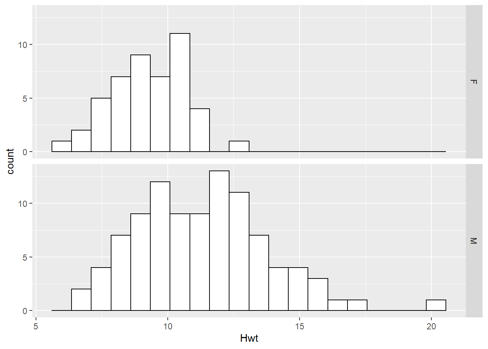
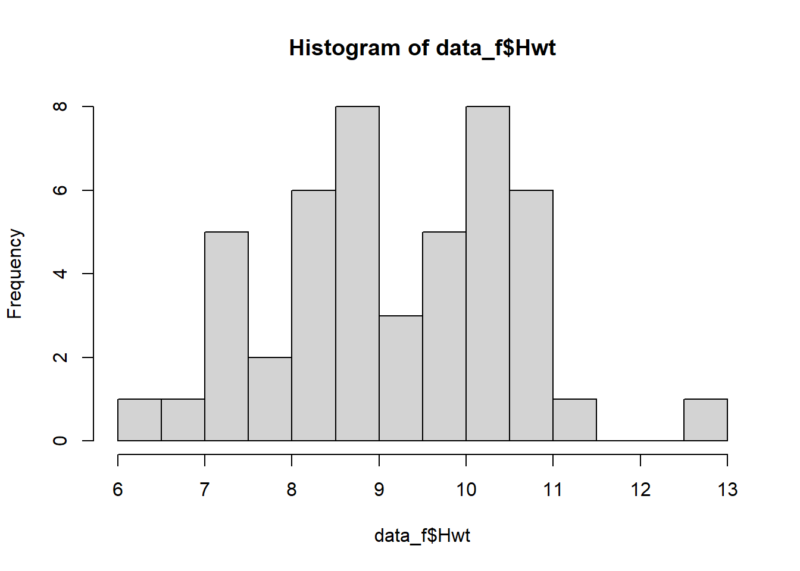
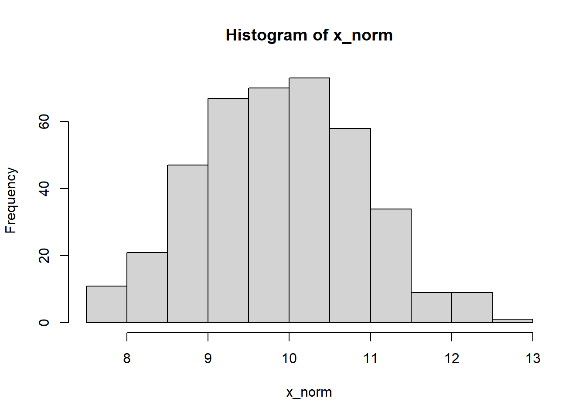
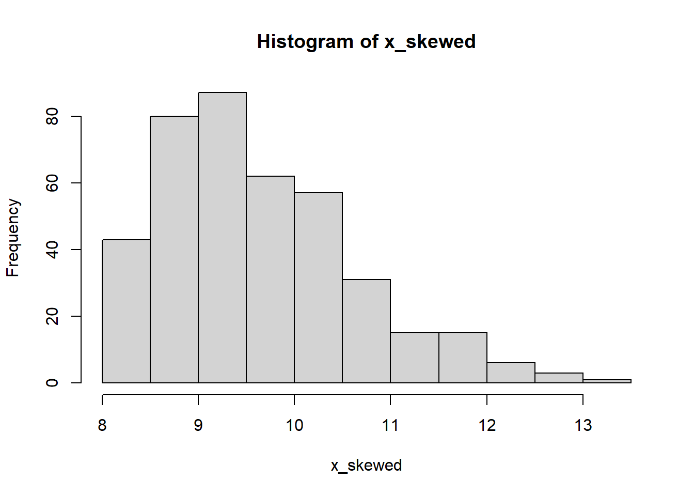

# Data

## Describing Data

The `cats` data set contains anatomical measurements from 144 cats. The data was originally recorded by the statistician R. A. Fisher in 1947 for the purpose of explaining various statistical techniques that he was developing at the time. Below is some information about the data set and the first six rows of data:

::: {.rmdnote}
**Example: Cats**

```
library(MASS)
?cats
```

**Description**

The heart and body weights of samples of male and female cats used for *digitalis* experiments. The cats were all adult, over 2 kg body weight.

**Usage**

`cats`

**Format**

This data frame contains the following columns:

`Sex`\
sex: Factor with levels "F" and "M".

`Bwt`\
body weight in kg.

`Hwt`\
heart weight in g.

**Source**

R. A. Fisher (1947) The analysis of covariance method for the relation between a part and the whole, *Biometrics* 3, 65--68.

**References**

Venables, W. N. and Ripley, B. D. (2002) *Modern Applied Statistics with S.* Fourth edition. Springer.

```
head(cats)
```


|Sex | Bwt| Hwt|
|:---|---:|---:|
|F   | 2.0| 7.0|
|F   | 2.0| 7.4|
|F   | 2.0| 9.5|
|F   | 2.1| 7.2|
|F   | 2.1| 7.3|
|F   | 2.1| 7.6|

**Number of rows:** 144
:::

The data set comprises horizontal **rows** and vertical **columns**. The values lying at the intersection of the rows and columns are the **data points**.

Each **row** corresponds to one experimental subject (in this case a cat). Each **column** represents a measurement or observation. Each **data point** is the value of a measurement against a specific subject.

We can describe the **data type** of each column as follows.

**Qualitative** data cannot be counted, measured or easily expressed using numbers. In the `cats` data set, `Sex` is qualitative since it can only take on the values 'Male' or 'Female'. **Factor** or **Categorical** are other words used to describe Qualitative data.

**Quantitative** data can counted or measured using numbers and often answer questions such as 'How many?' or 'How much?'. Quantitative data can either be continuous or discrete.

**Continuous data** can take on any value within a range and is usually expressed as a decimal value. The heart weight column in the `cats` data set is continuous.

**Discrete** data can only take on a limited number of values, typically whole numbers. 'number of teeth' would be a discrete column if it were included in the `cats` data.

## Data Visualisation

If we would like examine the data in order to draw some scientific conclusions, we can **visualise** the data in the form of a graph or plot. For example, we might expect heavier cats to have heavier hearts. Let's see if such a correlation exists by creating a scatter plot.

### Scatter Plot

A scatter plot is a very efficient way of presenting data. Making use of the human eye's ability to discern patterns we can clearly see a strong correlation between the two variables. But notice that we have of course lost some information - we can no longer discern the sex of the animals. When we visualise data, we usually lose some data too, so our choice of how we visualise data involves a trade-off.

```
plot(cats$Bwt, cats$Hwt)
```


::: {.rmdimportant}
**Question**

In the scatter plot, Why are the points lined up in columns? What does this tell you about the data? Do you think the body weight variable is continuous or discrete?

:::

### Dot Plot

A dot plot is a very simple means to present the values of a single variable. In the dot plot below we show the height weight variable, separated the data into two subsets Male and Female.


```
stripchart(Hwt~Sex, data=cats)
```


::: {.rmdimportant}
**Question**

What information about the data have we lost by presenting it in this way? Do you think this is a good way to present this data?
:::

### Histogram

```
hist(cats$Hwt)
```

<div class="figure">

<p class="caption">(\#fig:hist-compare-fig)A histogram of female cat heart weights (top) compared to male cat heart weights (bottom).</p>
</div>

Varying bin widths changes histogram appearance.

<div class="figure">

<p class="caption">(\#fig:histogram-bins-fig)A histogram of female cat heart weights with a bin width of 2 (left) and 0.5 (right).</p>
</div>

## Summary Statistics

A **summary statistic** is a number which describes a property of a data sample. Example of summary statistics that should already be familiar with are the mean, median and standard deviation.

### Median

The (sample) median is a value which divides the higher and lower half of a sample of data. You can think of it as the 'middle' value of the data. Along with the (sample) mean, it is a measure of **central tendency** (or **location**) which attempts to capture a typical 'central value' of the data.

### How to calculate the Median

Arrange $n$ values in increasing order.

if $n$ is odd: median is the middle value\
if $n$ is even: average of the two middle values

::: {.rmdnote}
**Example 1**

1, 3, 3, **6**, 7, 8, 9

Median = $6$

**Example 2**

1, 3, 3, **6**, **7**, 8, 9, 10

Median = $(6 + 7)/2 = 6.5$
:::

### Inter Quartile Range

The **inter quartile range** (or **IQR**) is the difference between the medians of the upper-half and lower-half of the data. The IQR measures how closely the data clusters around the median and, along with the variance and standard deviation, is a measure of **dispersion** or **spread**.

### How to calculate the IQR

Suppose we have $n$ values $x_1 \ldots x_n$.

**Lower Quartile** $Q_\mathrm{L}$

Let $i = \frac{1}{4}(n+1)$.

If $i$ is integer then $Q_\mathrm{L} = x_i$.\
Otherwise round $i$ down to integer, then $Q_\mathrm{L} = \frac{1}{2}\left(x_i+x_{i+1}\right)$.

**Upper Quartile** $Q_\mathrm{U}$

Let $i = \frac{3}{4}(n+1)$.

If $i$ is integer then $Q_\mathrm{U} = x_i$.\
Otherwise round $i$ down to integer, then $Q_\mathrm{U} = \frac{1}{2}\left(x_i+x_{i+1}\right)$.

**Interquartile Range (IQR)**

The interquartile range is the difference between the upper and lower quartiles:

$\mathrm{IQR} = Q_\mathrm{U} - Q_\mathrm{L}$.

::: {.rmdnote}
**Example**

1, 3, 3, 6, 7, 8, 9, 10

\begin{align*}
Q_\mathrm{L} &= \frac{1}{2}\left(3+3\right) = 3\\
Q_\mathrm{U} &=  \frac{1}{2}\left(8+9\right) = 8.5\\
\mathrm{IQR} &=  Q_\mathrm{U} - Q_\mathrm{L} = 8.5 - 3 = 5.5.
\end{align*}
:::

We can think of the IQR as defining the 'typical' values of the data set. Values lying within the lower and upper quartiles are 'close' to the median and are 'typical' values.


### Quantiles

We calculate quartiles by dividing the data evenly into four. We can generalise this by dividing the data into evenly into **quantitles** each of which contain the same proportion $p$ of the data points.

$p=$ proportion of the quantile\
$n=$ sample size

If $p(n+1)$ is an integer then $i=p(n+1)$ and $Q(p) = x_i$

Otherwise round $i$ down and $Q(p) = \frac{x_i+x_{i+1}}{2}$.

Quartiles are a special case of quintiles where $p = 0.25$.

::: {.rmdnote}
**Note**

The method shown here is just one way to calculate quartiles and quintiles. Other methods vary in how the rounding and averaging is performed. There are 9 options in R, and each will give a slightly different result for the IQR!
:::

### Box Plots

A very compact means to visualise these summary statistics is the **box plot**. A box plot presents the median and upper and lower quartiles as well as any outlying values.

An **outlier** is a data point which lies far outside the 'reasonable extremes' of the data. This is of course a rather subjective definition! It is common practice to define outliers in terms of the quantiles - for example we might define any value lying further than 1.5 IQRs from the upper quartile to be an outlier.

The box plots consists of a box representing the median and upper and lower quartiles. Extending from the box are two 'whiskers' which terminate at the farthest non-outlying point. Any values lying outside these extremes are considered outliers.

<div class="figure">

<p class="caption">(\#fig:boxplot-fig)A box plot (right).</p>
</div>

Box plots are commonly used to compare subsets of a data set. For example, we can compare the heart weights of male and female cats.

```
boxplot(Hwt~Sex, data=cats)
```


From this box plot we can quickly see that the male cats have (in general) heavier hearts than female cats. But we can also see that this is not true in every case: some female cats have heavier hearts than male cats. Furthermore, by comparing the upper and lower quartiles we can see that some 'typical' female cats have heavier hearts than some 'typical' male cats.

The box plot helps us to answer the question 'do male cats have heavier hearts than female cats?' but is not able to give us a definitive answer. In later lectures we will use quantitative techniques to help us address these kinds of questions in more detail.

::: {.rmdimportant}
**Question (Important!)**

We have used three types of plot (dot plot, histogram and box plot) to compare the heart weights of a sample of male and female cats.

Which type of plot do you think is best for answering the question 'do male cats have heavier hearts than female cats?' ?
:::

### Mean, Variance, Standard Deviation

The **sample mean** $\bar{x}$ is another measure of central tendency (or location) which attempts to represent a 'typical' value of the data set. 

$$\bar{x} = \frac{x_1 + \ldots + x_n}{n} = \frac{1}{n}\sum_{i=1}^{n}x_i$$

The **sample variance** $s^2$ and **standard deviation** $s$ are measures of spread (or 'dispersion')

**Sample variance:**

$$\mathrm{var} = s^2 = \frac{1}{n-1}\sum_{i=1}^{n}(\bar{x}-x_i)^2$$

The terms $\bar{x} - x_i$ in the calculation of sample variance are called **deviations** which measure how far each data point is from the mean. We can think of the variance as a kind of 'average' deviation. Squaring the deviations ensures that they are all positive - otherwise positive and negative deviations would cancel out. It also ensures that the variance has some 'nice' mathematical properties that we will take advantage of later.

Notice that we divide by $n-1$ rather than $n$. The $n-1$ term is called the **degrees of freedom** in calculating the sample variance. The reason for dividing by $n-1$ rather than $n$ is rather technical, but essentially it accounts for the fact that $\bar{x}$ is only an *estimate* of the mean. We will see degrees of freedom again later when we study hypothesis tests.


**Standard Deviation:**

$$s = \sqrt{s^2}$$
The standard deviation is simply the square root of the variance.

::: {.rmdnote}
**Note**

the symbols $\bar{x}$, $s$ and $s^2$ are standard symbols used in statistical analysis. If you see them in a report, you can be sure they are referring to sample mean, standard deviation and variance.
:::

### Interpreting the Standard Deviation

The standard deviation of a sample gives us a measure of dispersion of the data and is measured in the same units as the data. In Figure\ \@ref(fig:sd-fig) the heart weights of female cats are plotted along with the mean $\bar{x}$ and one and two standard deviations either side. Notice that the majority of points lie within one standard deviation of the mean, and very few lie more than two standard deviations of the mean. In fact this is a general property of many data sets - most points lie near the mean, with few lying further away. We can use the standard deviation serves as a 'yardstick' to determine how 'typical' a datapoint is.


<div class="figure">

<p class="caption">(\#fig:sd-fig)Heart weights of a sample of female cats.</p>
</div>

::: {.rmdnote}

**Example**

The heart weights of the sample of female cats has $\bar{x} = 9.2~\mathrm{g}$ and $s = 1.36~\mathrm{g}$. Suppose we weigh one more female heart and find that its weight is $14.4~\mathrm{g}$. How many standard deviations from the mean is it?

$$\frac{14.4 - \bar{x}}{s} =  \frac{14.4 - 9.2}{1.36} = 3.83. $$

The new data point is almost 4 standard deviations from the mean. This suggests that the data point is quite atypical - perhaps we should check this value carefully!

:::


## Shape of Histograms

Consider the histogram shown in Figure \@ref(fig:symmetric-fig). Its shape is typical for a data set we might encounter when taking scientific measurements. The majority of values are close to the mean, with fewer values in the 'tails', and the histogram is symmetrical about the mean. We say that data set is **symmetric** and **uni-modal** (single peak).

The mean and median of such a sample both coincide with the main peak.

<div class="figure">

<p class="caption">(\#fig:symmetric-fig)A symmetric distribution</p>
</div>

In contrast, the histogram shown in Figure \@ref(fig:skewed-fig) is asymmetric, with a long tail of values lying to the right of the peak. We say that it is **right-skewed**. The median of such a distribution is closer to the peak than the mean.

<div class="figure">

<p class="caption">(\#fig:skewed-fig)A skewed distribution</p>
</div>

Finally, consider the histogram in Figure \@ref(fig:bimodal-fig). Such a distribution with peaks is called **bimodal**. This can be a characteristic of two distinct datasets combined into one.

<div class="figure">

<p class="caption">(\#fig:bimodal-fig)A bimodal distribution</p>
</div>

::: {.rmdimportant}
**Question**

Suppose we took a random sample of UK household incomes. Do you think the corresponding histogram would be  
1. Symmetric or skewed?  
2. Unimodal or bimodal?

See if you can find a histogram of UK household incomes, and the mean and median household income. Do you think the mean or the median is more representative?
:::   
