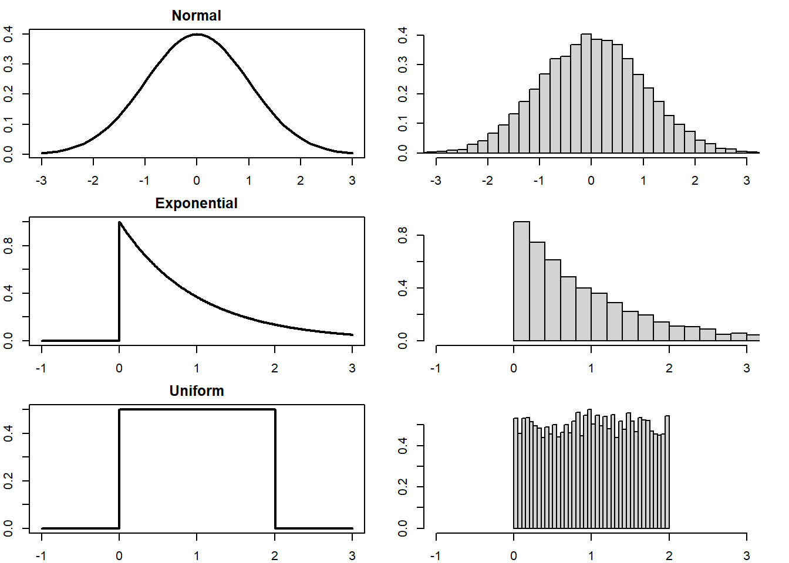
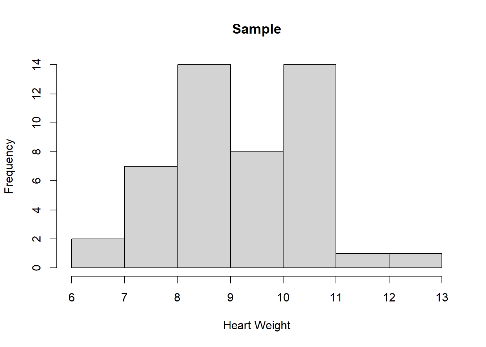
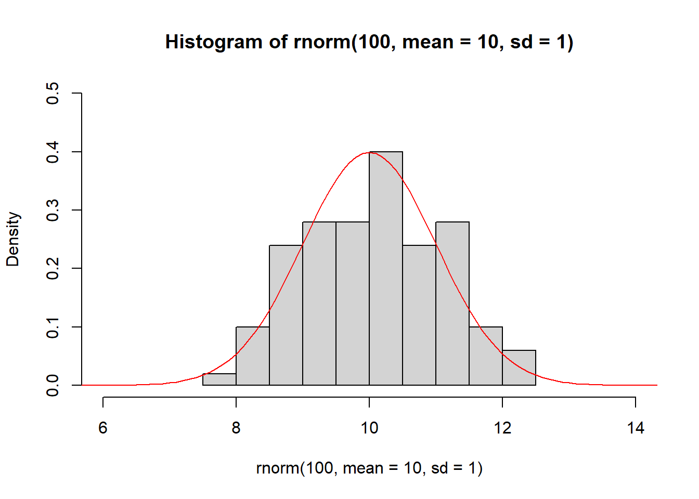
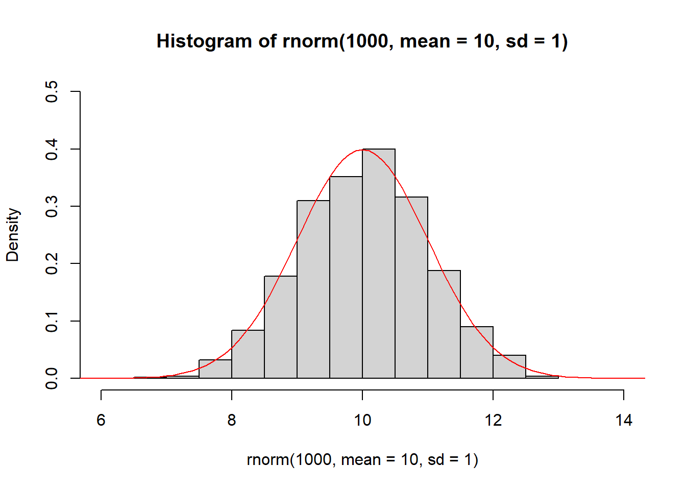
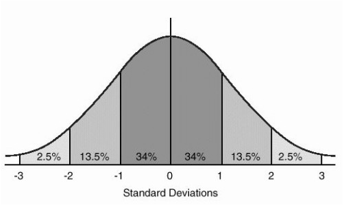
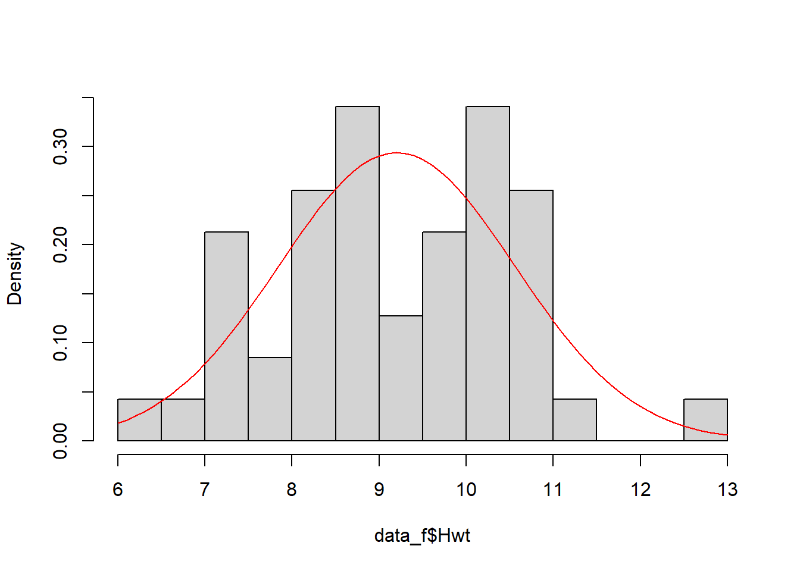
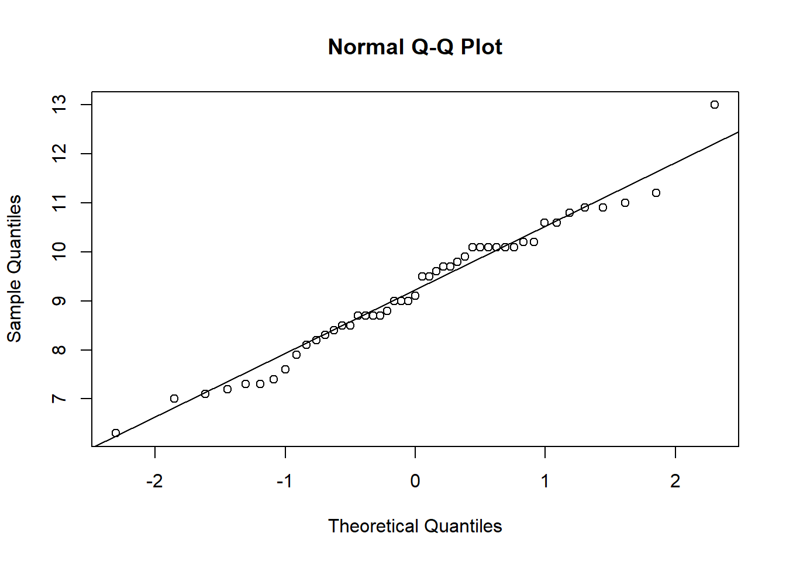

# Distributions

## Population vs Sample

In statistics, a **sample** is a finite set of values drawn from a larger **population**. The goal of inferential statistics - which we will examine in more detail in this course - is to **infer** properties of a population based on properties of a sample.

The 144 cats investigated by R. A. Fisher are a sample. We have already seen that the sample mean male heart weight is greater than the sample mean female heart weight. But what does this tell us about cats in general? Based on this study, can we conclude that male cats have heavier hearts than female cats?

We are no longer asking a question about the sample but about a population. In this case the population might be 'all male and female cats'.

<div class="figure">

<p class="caption">(\#fig:sample-population-fig)Sampling from a population.</p>
</div>

## Probability Distribution

A **probability density function (PDF)** is a mathematical function which describes the probability of a variable taking on a range of possible values. Plotting the PDF results in a curve which we call the **probability distribution**, where the height of the curve (on the y-axis) represents the likelihood that the variable will take a particular value (on the x-axis).

For continuous variables, the height of the curve represents probability *density*. This means that the probability of the variable taking on a range of values is the area under the curve.

A variable drawn from the probability distribution is called a **random variable**.

::: {.rmdnote}

**Probability of a Random Variable**

If $x$ is a random variable drawn from a distribution with PDF $f$ then the probability of $x$ taking on a value between $a$ and $b$ is the integral of $f$ between $a$ and $b$:

$$P(a < x < b) = \int^b_a f(t) \mathrm{d}t.$$

:::

Examples of three common distributions are illustrated in Figure\ \@ref(fig:distributions-fig). 
<div class="figure">

<p class="caption">(\#fig:distributions-fig)Examples of probability distributions (left) and histograms of samples drawn from each (right).</p>
</div>

## Sampling

**Sampling** is the process of drawing random variables from a known population distribution. A sample of size $n$ comprises $n$ random variables drawn from the distribution. The sample can be represented as a histogram, and the larger the sample size, the closer the histogram approximates the PDF (Figure\ \@ref(fig:sampling-fig)).

<div class="figure">

<p class="caption">(\#fig:sampling-fig)Sampling from a probability distribution.</p>
</div>

## Normal Distribution

The **normal distribution** is the most important probability distribution in statistics. The normal distribution has a characteristic 'bell-shaped' curve, with the majority of values clustered around a central peak. The distribution is symmetrical, with probabilities tapering off equally in both directions.

The PDF of the normal distribution is defined by a specific algebraic expression. The mean $\mu$ is the centre of the peak and the standard deviation $\sigma$ is the measure of its 'spread' (Figure\ \@ref(fig:normal-fig)).

:::{.rmdnote}
**PDF of the Normal Distribution**

The PDF of a normal distribution with mean $\mu$ and standard deviation $\sigma$ is given by:

$$f(x) = \frac{1}{\sigma\sqrt{2 \pi}}e^{-\frac{1}{2}\left(\frac{x-\mu}{\sigma}\right)^2}.$$
:::

<div class="figure">

<p class="caption">(\#fig:normal-fig)The probability density function of the normal distribution with mean $\mu = 5.0$ and standard deviation $\sigma = 1.5$ (left) and with mean $\mu = 7.0$ and standard deviation $\sigma = 0.5$ (right).</p>
</div>

Figure\ \@ref(fig:normal-samples-fig) demonstrates how the histogram of samples drawn from a normal distribution approximate its PDF.

<div class="figure">

<p class="caption">(\#fig:normal-samples-fig)The histogram of samples drawn from a normal distribution approximate the PDF of the normal distribution (red).</p>
</div>

## Probabilities of the Normal Distribution

When you have a normally distributed population, you can determine the proportion of the values that fall within a specified number of standard deviations from the mean. For example, in a normal distribution, 68% of the observations fall within +/- 1 standard deviation from the mean. Figure\ \@ref(fig:z-scores-fig) shows the proportion of observations that lie 1, 2 an more standard devations either side of the mean.

<div class="figure">

<p class="caption">(\#fig:z-scores-fig)Probabilities of the normal distribution.</p>
</div>

:::{.rmdnote}

**Example**

Let's suppose that a random variable $x$ is normally distributed with mean $\mu = 30$ and standard deviation $\sigma = 5$. We can determine that 68% of observations of $x$ will be between 25-35 (30 +/- 5), 95% between 20-40 $(30 +/- 2\times 5)$, and 99.7% between 15-45 $(30 +/-3\times 5)$.

:::

## Standard Normal Distribution and Z-Scores

The shape of the normal distribution curve depends on the values of the mean $\mu$ and standard deviation $\sigma$. However, the **standard normal distribution** is a special case of the normal distribution where $\mu=0$ and the $\sigma=1$. This distribution is also known as the **Z-distribution**.

A value on the standard normal distribution is known as a standard score or a Z-score. A standard score represents the number of standard deviations above or below the mean that a specific observation falls. For example, a standard score of 1.5 indicates that the observation is 1.5 standard deviations above the mean. On the other hand, a negative score represents a value below the average. The mean has a Z-score of 0.

**Standardisation** allows you to compare observations and calculate probabilities across different populations. To calculate the standard score for an observation, subtract the mean then divide by the standard deviation:

$$z = \frac{x - \mu}{\sigma},$$

where $x$ represents the value of the measurement of interest. $\mu$ and $\sigma$ represent the mean and standard devation of the normally distributed population from which the observation was drawn.

Suppose that the weights of a population of mice are normally distributed with mean $\mu = 30~\mathrm{g}$ and standard deviation $\sigma = 5~\mathrm{g}$.

The weight of a particular mouse is measured and found to be $38~\mathrm{g}$. The z-score of the mouse is therefore:

$$z = \frac{x - \mu}{\sigma} = \frac{38~\mathrm{g} - 30~\mathrm{g}}{5~\mathrm{g}} = 0.8.$$

The weight of the mouse is slightly less than one standard deviation above the mean.

:::{.rmdimportant}

**Question**

Use Figure\ \@ref(fig:z-scores-fig) to calculate the probability that an observation will lie more than 3 standard devations from the mean.
:::

## Areas Under the Curve of a Normal Distribution

From Figure\ \@ref(fig:z-scores-fig) we can determine the probability that an observation will lie various integral multiples of the standard deviation above or below the mean. But to calculate the probability of a general Z-score we need to calculate the area under the PDF of the normal distribution.

For example, what is the probability that a randomly-sampled mouse has a weight of $38~\mathrm{g}$ or less? We have already calculated that the z-score is $z = 0.8$ so the probability is just the area under the normal PDF to the left of $0.8$.

Fortunately, we don't typically have to do any calculus to solve this problem. Instead, we can look up the value in a table of pre-computed values. Traditionally we would use a standard [normal distribution table](http://www.z-table.com/)  but thse days it's far easier to get a computer to do the work for us. In R we use the function [`pnorm`](https://www.rdocumentation.org/packages/stats/versions/3.6.2/topics/Normal):

```
> pnorm(0.8)
[1] 0.8413447
```

The probability that a randomly-sampled mouse has a weight of $38~\mathrm{g}$ or less is $0.84$.

:::{.rmdimportant}
**Question**

Calculate the probability that a randomly-sampled mouse has a weight of $42~\mathrm{g}$ or *more*:  
1. Calculate the z-score corresponding to $x = 42~\mathrm{g}$.  
2. Use `pnorm` to calculate the area under the normal distribution to the left of the z-score.  
3. Use the fact that the area under the entire distribution is $1$ to calculate the area under the normal distribution to the *right* of the z-score.

:::

## Testing for Normality

How do we know if a sample of data comes from a normally distributed population? This is an extremely important question in statistics, because normality is an important assumption relied on by many statistical tests, including the hypothesis tests that we will study later.

To check if a sample is normally distributed we could plot its histogram then overlay the curve of a normal distribution with the same mean and standard deviation (Figure\ \@ref(fig:normal-overlay-fig), left).

Alternatively, rather than comparing the two distributions directly, we can compare their quantiles, resulting in what is called a **quantile-quantile plot** or **Q-Q plot**. Recall that a quantile is a value that divides the data into a given proportion. If the data set is normally distributed, we would expect the quantiles of the data set and the normal distribution to be identical. A Q-Q plot results from plotting the quantiles of the data against the quantiles of a normal distribution (Figure\ \@ref(fig:normal-overlay-fig), right). If the data is exactly normally distributed, the quantiles will lie on a straight line.


<div class="figure">

<p class="caption">(\#fig:normal-overlay-fig)(Left) female cat heart weights (histogram) compared to a normal distribution with equivalent mean and standard deviation (red line). (Right) a Q-Q plot of female heart weights (y-axis) against a standard normal distribution (x-axis).</p>
</div>
