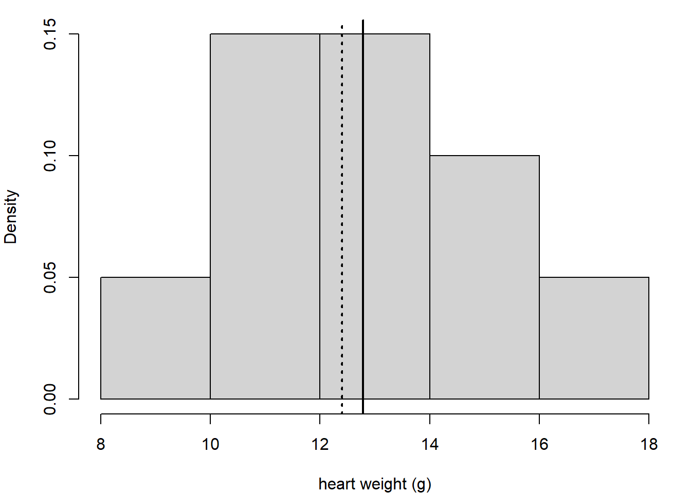

# Sampling

## Definitions

Recall that the **population** is the universe of possible experiments we would like to generalise. We suppose that the population has a certain distribution which is determined by **parameters**: true fixed values we would like to estimate. For example if we suppose that the population is normally distributed then the population parameters are the mean $\mu$ and standard deviation $\sigma$.

:::{.rmdnote}
**Important**

We can never know the actual population distribution! We only every observe a sample of data which has been measured through observation or experiment. The goal of statistical inference is to **infer** properties of the population by examining the sample.

It is important to keep this in mind during this section. Whenever we refer to the 'population distribution' we are in fact referring to an *assumed* distribution of the population.
:::

**Sample**  
The finite set of experiments sampled from the population.  
From the sample we calculate a (point) **estimate** of a population parameter.

E.g. sample mean $\bar{x}$, sample standard deviation $s$
**Point Estimate**  
Estimate the value of a population parameter.  
E.g. What is the best estimate of the concentration of lead in the River Lea?

**Confidence Interval**  
Estimate the precision of an estimate.  
E.g. Identify a range of values which (according to some measure of probability) contains the concentration of lead in the River Lea?

**Hypothesis Test**       
Determine whether a particular estimate could have occurred by chance.  
E.g. Could the elevated concentration of lead in the River Lea be attributed to chance (according to some measure of probability)?

## Estimates and Parameters

**Inference** is trying to draw conclusions about the population based on a sample from that population.

**Estimation** is using a statistic calculated from the sample as a point estimate of the population parameter.

> But how do we know how 'good' the estimate is...?

## Sampling Distribution

Our sample distribution varies from one sample to another. Therefore our sample mean (which is the point estimate of the population mean) also varies from sample to sample.

This variation is described by the **sampling distribution** of the point estimate.

Understanding this variation allows us to determine how much (or little) our point estimate tells us about our population.

## Example

Let us suppose that our population of interest is measurements of cat heart weights. We will assume that the population is normally distributed with mean $\mu = 12.4~\mathrm{g}$ and s.d. $\sigma = 2.9~\mathrm{g}$.

## Single sample of size $n = 10$.

10.58, 12.93,  9.98, 17.03, 13.36, 10.02, 13.81, 14.54, 14.07, 11.51
$$\bar{x} = 12.78$$

## Multiple samples of size $n=10$

## Sampling Distribution of the Mean    

10000 samples of size $n=10$.

## Standard Error

The **standard error of the mean** is the standard deviation of the distribution of sample means, given by the following important formula:

$$\mathrm{S.E.} = \frac{\sigma}{\sqrt{n}}$$

where $\sigma$ is the population standard deviation and $n$ is the sample size.

The standard error gives an estimate of the **precision** of our estimate.

**BUT**

We don't know the population standard deviation $\sigma$.

## Standard Error (Approximation)

If $n$ is large, then the sample standard deviation is a good approximation to the population standard deviation.

$$n \geq 30 \implies \sigma \approx s$$

$$\mathrm{S.E.} \approx \frac{s}{\sqrt{n}}$$

## Summary

- **Sampling variation** means that repeated sampling results in different sample means

- The **sampling distribution** describes the distribution of sample means with repeated sampling

- The **standard error** is the standard deviation of the sampling distribution and is a measure of the precision of the point estimate

## Confidence Intervals

A confidence interval is a numerical representation of the precision of our point estimate.

$$ \mathrm{CI} = \bar{x} \pm z_{\alpha/2} \times \mathrm{S.E.} = \bar{x} \pm z_{\alpha/2} \frac{\sigma}{\sqrt{n}} $$
where $z_{\alpha/2}$ is the z-score for the $1-\alpha$ confidence interval of the normal distribution*.

\*assuming the distribution of sample means is normally distributed. We will come back to this important point shortly.

## Confidence Interval Construction {.smaller}

An experiment is performed repeatedly resulting in $50$ measurements for a certain quantity. Given the sample mean $\bar{x} = 14.4$ and sample standard deviation $s = 1.71$, construct a 95% confidence interval for the mean of the quantity.

**1. Calculate the sample mean $\bar{x}$ and sample standard deviation $s$.**
 
 
 
**2. Calculate the standard error **
 
 
 
**3. Calculate the percentile $z_{\alpha/2}$ where $\alpha=1-0.95=0.05$**
 
 
 
**4. Calculate CI**

## Interpretation of Confidence Intervals

population mean $\mu = 100$, population s.d. $\sigma = 8$.
sample size $n = 16$.
$$\mathrm{S.E.} = \sigma/\sqrt{n}  = 8/4 = 2$$ 

100 95% confidence intervals sampled from population $\mu=100$, $\sigma=8$.

:::{.rmdnote}

**CORRECT**  
"95% of all confidence intervals constructed by this method will contain the population mean"

**CORRECT**  
"The probability that a randomly-sampled confidence interval will contain the population mean is 95%"

**INCORRECT/AMBIGUOUS/SLOPPY**  
"The probability that the population mean lies in my confidence interval is 95%" 

**NB**  
A confidence interval is a statement about a method of random sampling from a (theoretical) population - it is not a statement about data!
:::

## Example

**Q** The legal upper limit for a certain pollutant is 12.0 ppm. 35 samples were taken and the following sample statistics calculated:

$$\bar{x} = 12.2~\mathrm{ppm},\quad s = 0.55~\mathrm{ppm}$$
Calculate a 95% confidence interval for the mean pollutant concentration. Can we conclude that the upper limit was exceeded?

## Central Limit Theorem

Why is the Normal Distribution so important?
 
1. Experimental measurements are very often Normally Distributed (to a good approximation)
2. Sample means are very often Normally Distributed (to a good approximation) *even if the population is not normally distributed*

## Sampling Distribution (Normal Population)

## Sampling Distribution (Skewed Population)

## Central Limit Theorem

If $x_i \ldots x_n$ are $n$ independent random samples drawn from a population with mean $\mu$ and standard deviation $\sigma$ then 
$$\lim_{n \to \infty} \frac{\bar{x} - \mu}{\sigma/\sqrt{n}}$$
is a standard normal distribution.

- The distribution of sample means is approximately a normal distribution *even if the population distribution not normal*
  
- If the population is normally distributed, then the distribution of sample means is normal regardless of sample size

- If the population is not normally distributed, then the distribution of sample means is normal if the sample size $n$ is large ($n\geq 30$)

## Implications of Central Limit Theorem

 - The confidence interval calculation uses z-scores, which are based on the standard normal distribution

 - The Central Limit Theorem implies that we can use the method from the previous section to calculate confidence intervals, regardless of the population distribution
 
 - However, for a skewed population distribution, or where the population distribution is unknown, the sample size must be large
 
 - The more normal the population distribution, the smaller our sample size needs to be
 
 - To determine if the population distribution is normal, use your judgement or look at the data

## Summary

- Confidence intervals are an important tool to understand the precision of point estimates

- We can calculate a confidence interval based on a single sample using the standard error

- We need to carefully examine our assumptions about the population when interpreting the confidence interval

- Coming next: t-distribution and hypothesis testing
